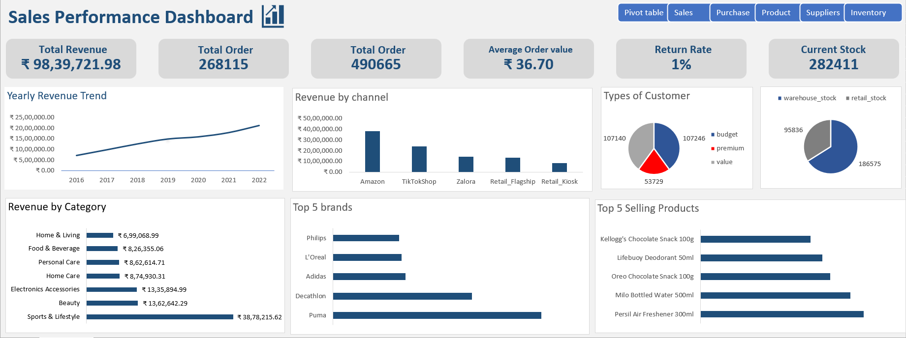
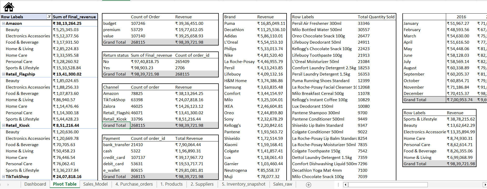
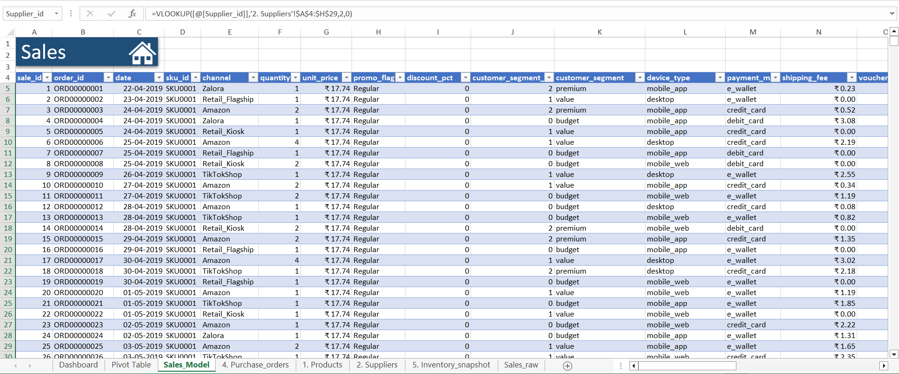

# 📊 Excel Sales Analytics Dashboard

Built a **Sales Performance Dashboard in Excel** using a multi-sheet retail dataset to simulate a real business analysis workflow.

**Workflow:**  
`Raw Data → Data Model → Pivot Analysis → Dashboard`

---

# 🔧 Tools Used

- Microsoft Excel  
- Pivot Tables  
- Structured Tables  
- VLOOKUP  
- Data Modeling  
- Dashboard Design  

---

# 📈 Key KPIs

- **Total Revenue:** ₹98,39,721  
- **Total Orders:** 268,115  
- **Units Sold:** 490,665  
- **Average Order Value:** ₹36.70  
- **Return Rate:** 1%  
- **Current Stock:** 282,411  

---

# 📊 Analysis Performed

- Revenue by **Channel**
- Revenue by **Category**
- Revenue by **Brand**
- **Customer Segment** distribution
- **Top Selling Products**
- **Payment Method Analysis**
- **Return Rate tracking**
- **Inventory stock distribution**

---

# 🧠 Data Modeling

Built a structured **Sales Model** by integrating multiple tables:

- Sales transactions
- Product catalog
- Supplier data
- Inventory snapshot
- Purchase orders

Functions used:

```
VLOOKUP
IF
Structured References
Date extraction (Month / Year)
```

---

# 📷 Project Screens

## Dashboard


---

## Pivot Table Analysis


---

## Sales Model


---

# 🚀 What This Project Demonstrates

- Data cleaning & preparation
- Multi-sheet Excel modeling
- Pivot-based business analysis
- KPI design
- Executive dashboard creation

---

# 📚 Course Context

This project was built after completing:

**Excel Skills for Business – Macquarie University (Coursera)**

---

# 📁 Dataset Structure

```
Sales_raw
Sales_Model
Products
Suppliers
Purchase_orders
Inventory_snapshot
Dashboard
Pivot_Table
```

---

# 📌 Outcome

This project demonstrates how Excel can transform **raw transactional data into structured business insights and dashboards**.